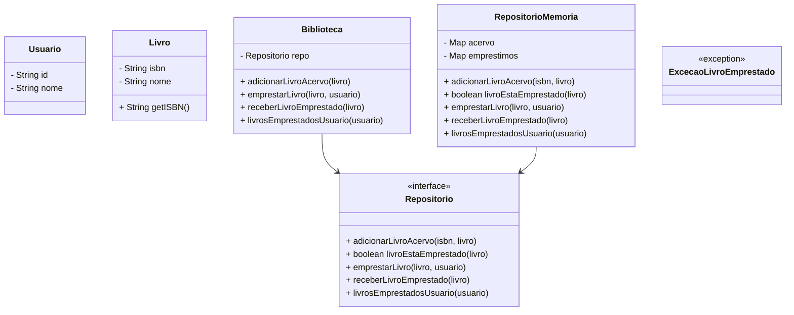

# Teste de Integração de um Sistema de Biblioteca

## Descrição
Este projeto simula a integração de um sistema de biblioteca, permitindo gerenciar livros, usuários e empréstimos. O sistema é modular, usando uma interface de repositório (`Repositorio`) para armazenamento, permitindo fácil substituição ou extensão da implementação de persistência de dados.  

## Diagrama de Classes

## Funcionalidades

Adicionar livros ao acervo da biblioteca.

Emprestar livros a usuários, garantindo que livros já emprestados não possam ser duplicadamente emprestados.

Receber livros devolvidos.

Consultar quais livros estão emprestados a um usuário específico.

## Tecnologias

Linguagem: Java

Testes: JUnit 5

## Como usar

Criar uma instância do repositório, por exemplo, RepositorioMemoria.

Criar instâncias de Usuario e Livro.

Criar uma instância de Biblioteca passando a implementação do Repositorio.

Usar os métodos da biblioteca para adicionar livros, emprestar e receber livros.

## Exemplo de uso
Repositorio repo = new RepositorioMemoria();
Biblioteca biblioteca = new Biblioteca(repo);

Usuario usuario = new Usuario("1", "Alice");
Livro livro = new Livro("123456789", "Java Básico");

biblioteca.adicionarLivroAcervo(livro);

try {
    biblioteca.emprestarLivro(livro, usuario);
} catch (ExcecaoLivroEmprestado e) {
    System.out.println("O livro já está emprestado!");
}

List<Livro> livrosDoUsuario = biblioteca.livrosEmprestadosUsuario(usuario);
biblioteca.receberLivroEmprestado(livro);

## Testes com JUnit 5

O projeto inclui testes unitários e testes de integração com JUnit 5.

Validam empréstimos e devoluções individuais.

Verificam que a lista de livros emprestados por usuário está correta.

Garantem que tentar emprestar um livro já emprestado lance ExcecaoLivroEmprestado.

Cobrem cenários de integração completa, incluindo múltiplos usuários e fluxo de empréstimos/devoluções.

 ### Exemplo de teste unitário
@Test
void testaEmprestarLivroJaEmprestado() throws ExcecaoLivroEmprestado {
    bib.emprestarLivro(livro1, usuario1);

    assertThrows(ExcecaoLivroEmprestado.class, () -> {
        bib.emprestarLivro(livro1, usuario2);
    });
}

### Exemplo de teste de integração
@Test
void integracaoFluxoCompleto() throws ExcecaoLivroEmprestado {
    bib.emprestarLivro(livro1, usuario1);
    bib.emprestarLivro(livro2, usuario1);
    bib.emprestarLivro(livro3, usuario2);

    assertEquals(2, bib.livrosEmprestadosUsuario(usuario1).size());
    assertEquals(1, bib.livrosEmprestadosUsuario(usuario2).size());

    bib.receberLivroEmprestado(livro2);

    assertEquals(1, bib.livrosEmprestadosUsuario(usuario1).size());
    assertEquals(1, bib.livrosEmprestadosUsuario(usuario2).size());
}

